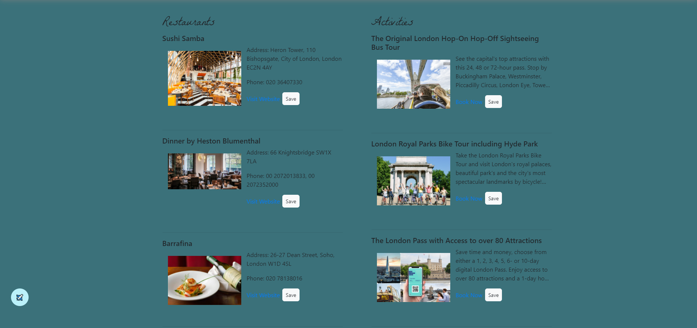
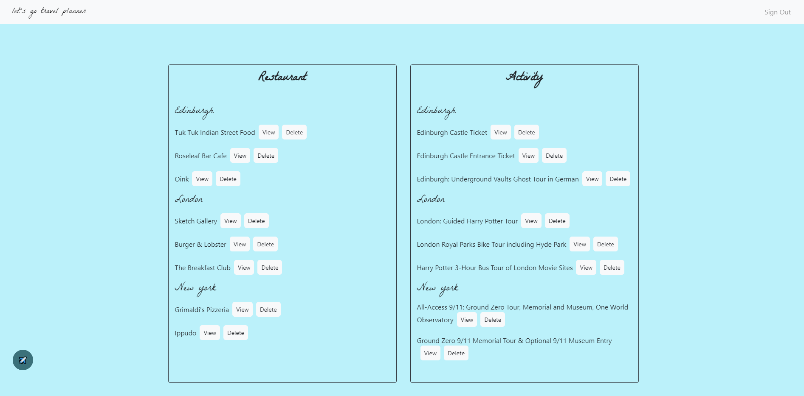
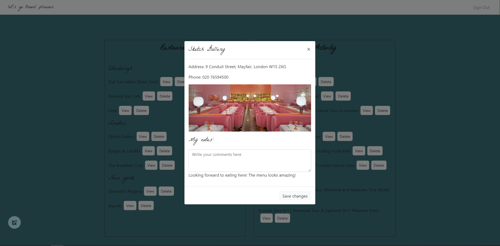

# Let's Go Travel Planner


## Table Of Contents
  - [Description](#description)
  - [Technologies Used](#technologies-used)
  - [Screenshot](#screenshot)
  - [Installation](#installation)
  - [Usage](#usage)
  - [View Live Website](#view-live-website)
  - [Testing](#testing)
  - [Contributing](#contributing)
  - [Questions](#questions)
  - [License](#license)

## Description
Let's Go Travel Planner is a travel app that helps users plan their trips effortlessly. The app lets users input the name of the city that they would like to travel to. Whenever a user submits a city name, the app will display a list of recommendations for restaurants and activities to do in the city. Users will also be able to create an account and save their itinerary for easy viewing.

## Technologies Used

The application was developed using the following technologies:
- Javascript
- HTML/CSS
- Mysql
- Sequelize
- Bootstrap
- Bcryptjs
- Darkmode
- Dotenv
- Express
- Express-handlebars
- Express-session
- Node-fetch
- Nodemon
- Passport
- Jest
- Eslint
- Travis CI
- Supertest
- Heroku
- Jquery
- Node
- Zomato API
- Amadeus API

## Screenshot

Homepage 


Search Results


View Itinerary


View Details 


## Installation

The application can be installed by using the following command: 

```bash
git clone https://github.com/Mcilhaggis/lets-go-travel-planner.git
```

## Usage

First, create the following file in the root of the project:
```
.env
```
Then, within this file you will need to add your API keys and Amadeus API secret after the "="
```
API_KEY= (YOUR ZOMATO API KEY)
CLIENT_ID= (YOUR AMADEUS API KEY)
CLIENT_SECRET= (YOUR AMADEUS API SECRET KEY)
```
For more information on how to obtain the keys, please visit the websites below: <br />
https://developers.amadeus.com/ <br />
https://developers.zomato.com/api <br />


Then, run the below command to install the required package:

```bash
npm install
```
The application can then be invoked by using the following command: 

```bash
node server.js
```

Or alternatively you can run this application using Nodemon. To invoke this app with Nodemon, type in the following command:
```bash
nodemon server.js
``` 

## View Live Website  
Please click **[here](https://stormy-springs-60842.herokuapp.com/)** to view the live webpage hosted on Heroku.

## Testing

There are a total of 4 tests that will run using the commands below.

First, run the below command to install the required package:

```bash
npm install
```
The tests can then be invoked by using the following command: 

```bash
npm run testApi 
```

## Contributing

Pull requests are welcome. For major changes, please open an issue first to discuss what you would like to change.

## Questions

Please contact one of our team members if you have any questions regarding the application:

- Cayman <br />
https://github.com/caymanh <br />
hengcayman@gmail.com <br />
- Rachael <br />
https://github.com/Mcilhaggis <br />
rachael.mcilhagga@live.co.uk <br />
- Tayyaba <br />
https://github.com/tasad667023 <br />
tayyaba.asad1234@gmail.com <br />
- Yenyu <br />
https://github.com/yenyulai <br />
yenyulai98@gmail.com <br />
- Hustin <br />
https://github.com/hustinkava <br />
hkavafsd@gmail.com <br />


## License

This application is covered by the [MIT](https://choosealicense.com/licenses/mit/) licence.


